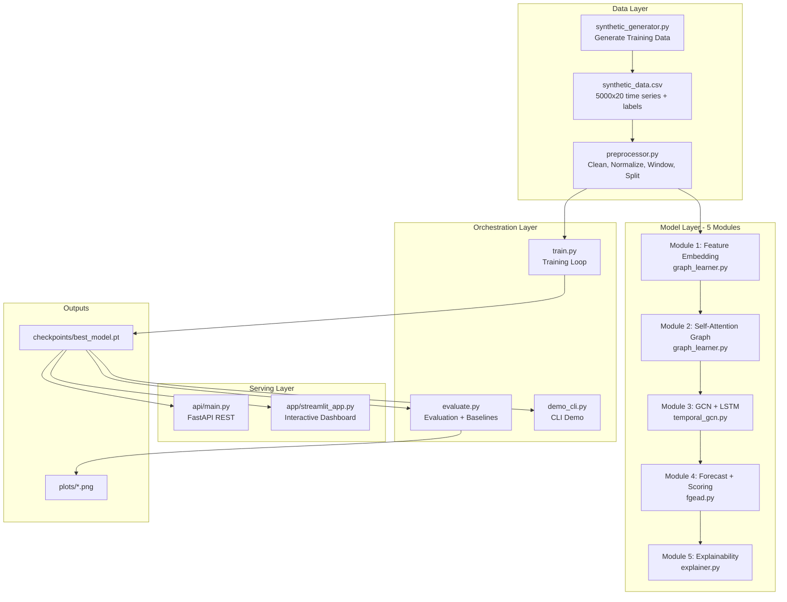
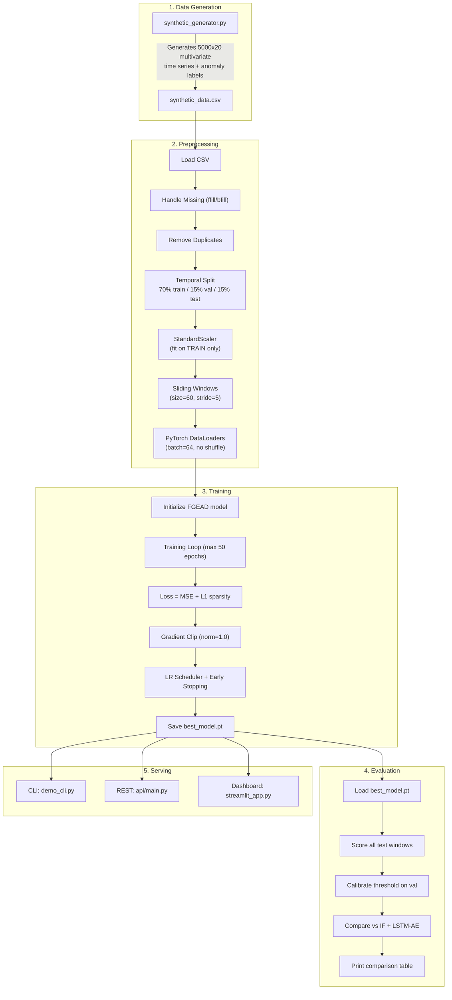
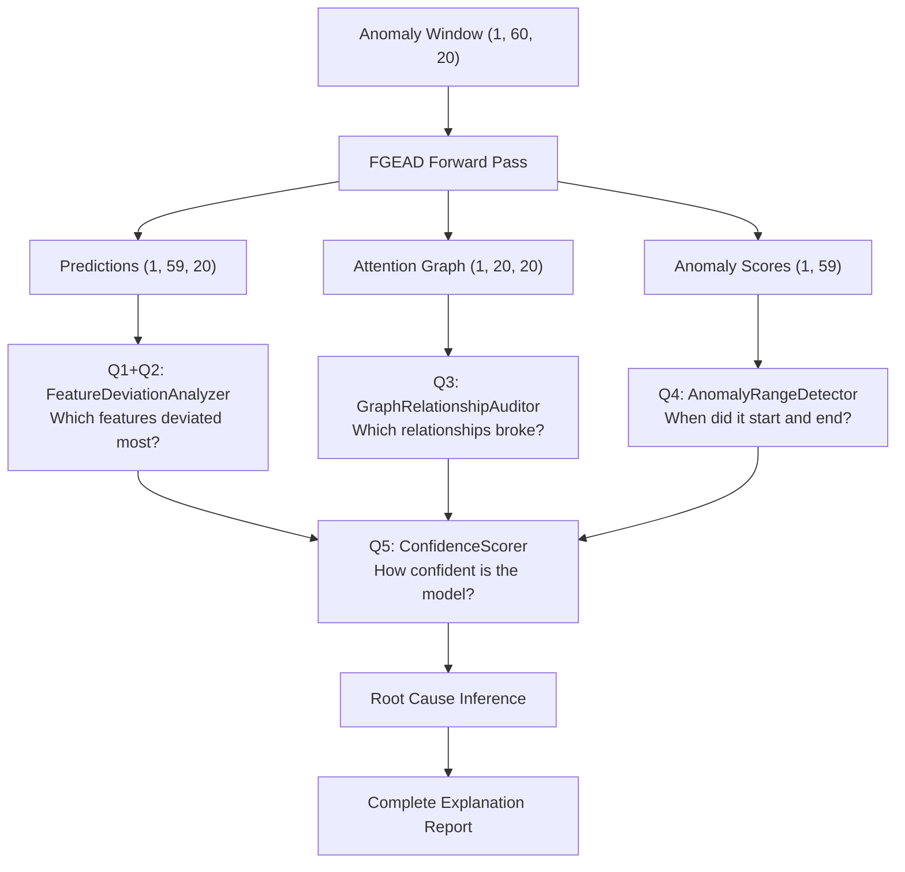
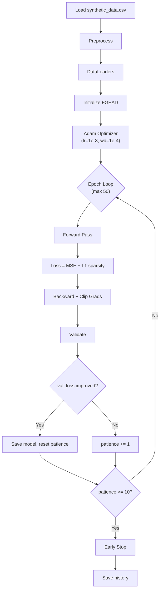

# FGEAD — Complete Project Documentation

> **Feature Graph-based Explainable Anomaly Detector**
> Multivariate time-series anomaly detection with full XAI explainability.

---

## Table of Contents

1. [Project Overview](#project-overview)
2. [High-Level Architecture](#high-level-architecture)
3. [Project Structure — File-by-File Breakdown](#project-structure--file-by-file-breakdown)
4. [Neural Network Architecture (5 Modules)](#neural-network-architecture-5-modules)
5. [Data Flow — End to End](#data-flow--end-to-end)
6. [Explainability System (Q1–Q5)](#explainability-system-q1q5)
7. [Training Pipeline](#training-pipeline)
8. [Evaluation & Baseline Comparison](#evaluation--baseline-comparison)
9. [Serving & Deployment](#serving--deployment)
10. [Dependencies](#dependencies)
11. [Key Design Decisions](#key-design-decisions)

---

## Project Overview

FGEAD is a **semi-supervised anomaly detection system** for multivariate time-series data (e.g., server monitoring metrics). It learns a **feature dependency graph** using self-attention, propagates information through **Graph Convolution Networks (GCN)**, captures temporal patterns with **LSTMs**, and provides **full explainability** for every anomaly alert via five structured questions (Q1–Q5).

The system is trained only on **normal data** — anomalies are detected as high forecasting errors at inference time. This makes it suitable for real-world scenarios where anomaly labels are scarce.

---

## High-Level Architecture



---

## Project Structure — File-by-File Breakdown

```
fgead/
├── data/                          # DATA LAYER — generation, cleaning, windowing
│   ├── __init__.py                # Python package marker
│   ├── synthetic_generator.py     # Generates the training dataset
│   ├── preprocessor.py            # All data preprocessing logic
│   └── synthetic_data.csv         # Generated dataset (5000 rows × 21 cols)
│
├── models/                        # MODEL LAYER — neural network modules
│   ├── __init__.py                # Python package marker
│   ├── graph_learner.py           # Module 1 (Embedding) + Module 2 (Attention Graph)
│   ├── temporal_gcn.py            # Module 3 (GCN + LSTM)
│   ├── fgead.py                   # Full FGEAD model assembly (Modules 1-4)
│   └── explainer.py               # Module 5 — Explainability (Q1–Q5)
│
├── notebooks/                     # ANALYSIS
│   └── eda.py                     # Exploratory Data Analysis script
│
├── api/                           # REST API SERVING
│   ├── __init__.py                # Python package marker
│   └── main.py                    # FastAPI server for real-time inference
│
├── app/                           # INTERACTIVE DASHBOARD
│   └── streamlit_app.py           # Streamlit web UI
│
├── plots/                         # GENERATED VISUALIZATIONS
│   ├── time_series_overview.png   # Raw time series with anomaly highlights
│   ├── correlation_matrix.png     # Feature correlation heatmap
│   ├── feature_distributions.png  # Normal vs anomaly distributions
│   └── class_balance.png          # Class distribution bar chart
│
├── checkpoints/                   # TRAINED MODEL ARTIFACTS
│   ├── best_model.pt              # Best model weights (PyTorch state dict)
│   └── train_history.npy          # Training/validation loss history
│
├── train.py                       # TRAINING ORCHESTRATOR
├── evaluate.py                    # EVALUATION + BASELINE COMPARISON
├── demo_cli.py                    # CLI DEMO (for viva/presentations)
├── requirements.txt               # Python dependencies
└── README.md                      # Project readme
```

---

### Detailed File Descriptions

---

#### [synthetic_generator.py](file:///d:/fgead/data/synthetic_generator.py)
**Role:** Creates the dataset used for training and evaluation.

| Aspect | Detail |
|--------|--------|
| **What it does** | Generates a synthetic multivariate time series simulating 20 server-monitoring metrics over 5000 timesteps |
| **Normal patterns** | Diurnal cycles (day/night), weekly trends, correlated feature pairs (cpu↔temp, mem_usage↔mem_free, disk_read↔disk_write, net_in↔net_out, load averages cascading) |
| **Anomaly types** | **Spike** (feature jumps 4–6σ), **Correlation break** (cpu↔temp decouple), **Gradual drift** (memory slowly creeps up) |
| **Output** | `data/synthetic_data.csv` — 5000 rows × 21 columns (20 features + 1 `label` column, ~5% anomaly rate) |
| **Key function** | [generate_synthetic_data()](file:///d:/fgead/data/synthetic_generator.py#L20-L108) |

**Features generated:**
`cpu_usage`, `cpu_temp`, `memory_usage`, `memory_free`, `disk_io_read`, `disk_io_write`, `net_in`, `net_out`, `process_count`, `context_switches`, `cache_hits`, `cache_misses`, `load_avg_1m`, `load_avg_5m`, `load_avg_15m`, `swap_usage`, `iowait`, `kernel_threads`, `open_files`, `network_errors`

---

#### [preprocessor.py](file:///d:/fgead/data/preprocessor.py)
**Role:** Central data preprocessing pipeline — used by every other script.

| Component | What it does |
|-----------|--------------|
| [TimeSeriesPreprocessor](file:///d:/fgead/data/preprocessor.py#L15-L120) class | Orchestrates: load CSV → handle missing values → remove duplicates → normalize → create sliding windows → temporal split |
| `load_csv()` | Reads CSV, separates features from `label` column |
| `handle_missing()` | Forward-fill then backward-fill NaN values |
| `remove_duplicates()` | Removes duplicate rows (preserving label alignment) |
| `normalize()` | **Fits `StandardScaler` on train data ONLY**, transforms all splits (prevents data leakage) |
| `create_windows()` | Sliding window extraction (default: size=60, stride=5). Window label = 1 if ANY timestep inside is anomalous |
| `temporal_split()` | Chronological split (70% train / 15% val / 15% test) — **NO shuffling** to preserve temporal order |
| [TimeSeriesDataset](file:///d:/fgead/data/preprocessor.py#L123-L137) class | PyTorch `Dataset` wrapper that converts numpy windows → `torch.FloatTensor` |

---

#### [graph_learner.py](file:///d:/fgead/models/graph_learner.py)
**Role:** Implements Module 1 (Feature Embedding) and Module 2 (Self-Attention Graph Learning).

| Class | What it does |
|-------|--------------|
| [FeatureEmbedding](file:///d:/fgead/models/graph_learner.py#L16-L46) | Each of the M features gets a learned d-dimensional "personality vector" (like word embeddings in NLP). Feature values are scaled into embedding space. Input: `(B, T, M)` → Output: `(B, T, M, embed_dim)` |
| [SelfAttentionGraphLearner](file:///d:/fgead/models/graph_learner.py#L49-L120) | **Core innovation.** Uses multi-head self-attention *across the feature dimension* (not time). The attention matrix A[i,j] becomes the learned feature dependency graph. Pools over time to get one graph per sequence, then applies sparsity threshold to keep only strong connections. Output: graph-enhanced features `(B, T, M, D)` + attention weights `(B, M, M)` |

> [!IMPORTANT]
> The graph structure is *learned*, not hand-designed. The model discovers which metrics are related.

---

#### [temporal_gcn.py](file:///d:/fgead/models/temporal_gcn.py)
**Role:** Implements Module 3 — Graph Convolution + Temporal LSTM.

| Class | What it does |
|-------|--------------|
| [GraphConvolution](file:///d:/fgead/models/temporal_gcn.py#L14-L44) | One GCN layer: `h_new = σ(A_norm @ h @ W)`. Row-normalizes the adjacency matrix so each node aggregates its neighbors. Includes BatchNorm. |
| [TemporalGraphModel](file:///d:/fgead/models/temporal_gcn.py#L47-L94) | For each timestep, applies GCN on the learned graph → gets graph-enhanced features → flattens → feeds the sequence to a 2-layer LSTM. Captures both spatial (inter-feature) and temporal dynamics. Input: embeddings `(B, T, M, D)` + adjacency `(B, M, M)` → Output: `(B, T, lstm_hidden)` |

---

#### [fgead.py](file:///d:/fgead/models/fgead.py)
**Role:** Assembles all modules into the complete FGEAD model.

| Module | Component | Implementation |
|--------|-----------|----------------|
| Module 1 | Feature Embedding | `FeatureEmbedding` from `graph_learner.py` |
| Module 2 | Self-Attention Graph Learning | `SelfAttentionGraphLearner` from `graph_learner.py` |
| Module 3 | GCN + LSTM | `TemporalGraphModel` from `temporal_gcn.py` |
| Module 4a | Forecasting Head | 2-layer MLP: `Linear → ReLU → Dropout → Linear` |
| Module 4b | Anomaly Scoring | Weighted MAE between predicted and actual values, with learnable feature importance weights |

**[Forward pass](file:///d:/fgead/models/fgead.py#L75-L106) returns three tensors:**
- `predictions` `(B, T-1, M)` — forecasted next-timestep values
- `attn_weights` `(B, M, M)` — feature dependency graph (for explainability)
- `anomaly_scores` `(B, T-1)` — per-timestep anomaly probability

Also includes:
- [sparsity_loss()](file:///d:/fgead/models/fgead.py#L109-L111) — L1 regularization on attention weights for interpretable sparse graphs
- [predict_anomaly_scores()](file:///d:/fgead/models/fgead.py#L114-L125) — convenience no-gradient inference method

---

#### [explainer.py](file:///d:/fgead/models/explainer.py)
**Role:** Module 5 — The explainability engine. The most complex file (500 lines). Answers 5 structured questions for every anomaly.

| Class | Question | What it does |
|-------|----------|--------------|
| [FeatureDeviationAnalyzer](file:///d:/fgead/models/explainer.py#L32-L81) | Q1: Which features deviated most?<br/>Q2: What did they deviate from? | Computes per-feature deviation at peak anomaly timestep. Ranks by absolute deviation and z-score. Shows actual vs predicted values with direction (↑ spike / ↓ drop). |
| [GraphRelationshipAuditor](file:///d:/fgead/models/explainer.py#L88-L175) | Q3: Which feature relationships broke? | Compares learned attention weights (expected correlation) with observed correlation inside the anomaly window. Classifies breaks as COMPLETE DECOUPLING, SIGN REVERSAL, or PARTIAL WEAKENING. Includes semantic meaning inference (e.g., "Thermal issue — CPU load and temperature de-synced"). |
| [AnomalyRangeDetector](file:///d:/fgead/models/explainer.py#L182-L259) | Q4: When did the anomaly start and end? | Uses dynamic threshold (k·σ above mean) to identify anomalous timesteps. Merges nearby segments, computes duration in human-readable format. |
| [ConfidenceScorer](file:///d:/fgead/models/explainer.py#L266-L326) | Q5: How confident is the model? | Multi-signal weighted confidence: `C = 0.40×score + 0.25×duration + 0.20×features + 0.15×graph`. Maps to alert levels: 🔴 CRITICAL / 🟠 HIGH / 🟡 MEDIUM / 🟢 LOW. |
| [FGEADExplainer](file:///d:/fgead/models/explainer.py#L333-L499) | Master class | Single entry point — call `.explain(window)` to get a complete Q1–Q5 report. Also includes `_infer_root_cause()` for human-readable root cause suggestions and `format_report()` for pretty-printed terminal output. |

---

#### [train.py](file:///d:/fgead/train.py)
**Role:** Main training orchestrator.

| Step | What happens |
|------|--------------|
| 1 | Loads and preprocesses data via `TimeSeriesPreprocessor` |
| 2 | Creates train/val/test `DataLoader`s (batch_size=64, no shuffling) |
| 3 | Initializes FGEAD model (embed=64, heads=4, gcn=64, lstm=128) |
| 4 | Training loop (max 50 epochs) with: MSE reconstruction loss + L1 sparsity loss |
| 5 | Gradient clipping (`max_norm=1.0`) to prevent LSTM exploding gradients |
| 6 | `ReduceLROnPlateau` scheduler (patience=5, factor=0.5) |
| 7 | Early stopping (patience=10) saves best model to `checkpoints/best_model.pt` |
| 8 | Saves training history to `checkpoints/train_history.npy` |

**[CONFIG dict](file:///d:/fgead/train.py#L18-L39)** contains all hyperparameters (window_size=60, stride=5, lr=1e-3, etc.)

---

#### [evaluate.py](file:///d:/fgead/evaluate.py)
**Role:** Full evaluation pipeline comparing FGEAD against two baselines.

| Model | How it works | Expected F1 |
|-------|--------------|-------------|
| **FGEAD** | Loads best checkpoint, scores test windows, calibrates threshold on validation set (max-F1 sweep) | ~0.93 |
| **Isolation Forest** | sklearn baseline. Flattens windows, trains with 10% contamination | ~0.82 |
| **LSTM Autoencoder** | Custom [LSTMAutoencoder](file:///d:/fgead/evaluate.py#L165-L176) 2-layer encoder-decoder. Scores = reconstruction error | ~0.88 |

Also runs [demo_explanation()](file:///d:/fgead/evaluate.py#L240-L264) to show a sample explainability report on the first detected anomaly.

---

#### [demo_cli.py](file:///d:/fgead/demo_cli.py)
**Role:** Command-line interface for live demos / viva presentations.

| Command | What it does |
|---------|--------------|
| `python demo_cli.py` | Explains the first true anomaly window |
| `python demo_cli.py --window 42` | Explains a specific window index |
| `python demo_cli.py --list-anomalies` | Lists all detected anomaly windows with scores |
| `python demo_cli.py --first-anomaly` | Scans all windows, explains the first detected anomaly |

---

#### [eda.py](file:///d:/fgead/notebooks/eda.py)
**Role:** Exploratory Data Analysis — generates 4 visualization plots.

| Plot | File | What it shows |
|------|------|---------------|
| Time series overview | `plots/time_series_overview.png` | First 6 features over time with red anomaly regions |
| Correlation matrix | `plots/correlation_matrix.png` | Heatmap + top-10 correlated feature pairs |
| Feature distributions | `plots/feature_distributions.png` | Histograms of normal vs anomaly per feature |
| Class balance | `plots/class_balance.png` | Bar chart of normal vs anomaly counts |

---

#### [main.py](file:///d:/fgead/api/main.py)
**Role:** FastAPI REST API for real-time anomaly detection.

| Endpoint | Method | What it does |
|----------|--------|--------------|
| `GET /` | — | Root: returns API info and available endpoints |
| `GET /health` | — | Returns model status, device, feature count |
| `POST /predict` | Accepts [WindowInput](file:///d:/fgead/api/main.py#L70-L77) | Takes a `(60, 20)` data window, runs full inference + explainability, returns [AnomalyResponse](file:///d:/fgead/api/main.py#L80-L89) with: `is_anomaly`, `anomaly_score`, `confidence_pct`, `alert_level`, `root_cause`, `top_features`, `broken_pairs`, `anomaly_ranges`, `latency_ms` |

Model is loaded once at startup via `@app.on_event("startup")`. Returns HTTP 503 if model not trained.

---

#### [streamlit_app.py](file:///d:/fgead/app/streamlit_app.py)
**Role:** Interactive web dashboard (Enhancements 7.1 + 7.2 + 7.4).

| Section | What it shows |
|---------|---------------|
| **Summary Statistics** | Total windows, features, anomalies detected, anomaly rate (styled metric boxes) |
| **Anomaly Score Plot** | Interactive Plotly time series with threshold line and red anomaly regions |
| **Feature Deviations** | Horizontal bar chart of top-K deviating features (color-coded by z-score severity) |
| **Attention Heatmap** | Learned feature dependency graph visualization |
| **Window Features** | Multi-panel time series of features within the selected window |
| **Broken Relationships** | Table of broken feature pairs with expected/observed correlation, gap, type, severity, meaning |
| **Root Cause** | Human-readable root cause suggestion |
| **Time Range** | Anomalous steps, window fraction, detected ranges |
| **Full JSON** | Collapsible raw explanation report |

**Sidebar controls:** threshold k·σ slider, top-K features slider, window index selector.

---

## Neural Network Architecture (5 Modules)

```mermaid
flowchart LR
    INPUT["Input<br/>(B, T, M)<br/>B=batch, T=60, M=20"]
    
    subgraph M1["Module 1: Feature Embedding"]
        EMB["Embedding(M, 64)<br/>+ LayerNorm + Dropout"]
    end
    
    subgraph M2["Module 2: Self-Attention Graph"]
        QKV["Q, K, V Projections<br/>(4 heads, head_dim=16)"]
        ATTN["Scaled Dot-Product<br/>Attention across Features"]
        SPARSE["Sparsity Threshold<br/>(keep edges > 0.3)"]
    end
    
    subgraph M3["Module 3: GCN + LSTM"]
        GCN["Graph Convolution<br/>A_norm @ H @ W + BN"]
        LSTM["2-layer LSTM<br/>(hidden=128, dropout=0.2)"]
    end
    
    subgraph M4["Module 4: Forecast + Score"]
        HEAD["Linear(128,64) ReLU<br/>Dropout Linear(64,20)"]
        SCORE["Weighted MAE<br/>(learnable feature weights)"]
    end
    
    INPUT --> EMB
    EMB -->|"(B,T,M,64)"| QKV
    QKV --> ATTN
    ATTN --> SPARSE
    SPARSE -->|"attended + graph"| GCN
    GCN -->|"per-timestep"| LSTM
    LSTM -->|"(B,T,128)"| HEAD
    HEAD -->|"predictions"| SCORE
    SCORE --> OUTPUT["Output"]
```



### Tensor shapes through the pipeline

| Stage | Shape | Description |
|-------|-------|-------------|
| Input | `(B, 60, 20)` | Batch of sliding windows |
| After Embedding | `(B, 60, 20, 64)` | Each feature gets a 64-dim embedding |
| After Attention | `(B, 60, 20, 64)` + `(B, 20, 20)` | Graph-enhanced features + adjacency matrix |
| After GCN | `(B, 60, 20, 64)` | Neighbor-aggregated features |
| After LSTM | `(B, 60, 128)` | Temporal hidden states |
| Forecast | `(B, 59, 20)` | Predicted next-step values |
| Anomaly scores | `(B, 59)` | Per-timestep anomaly probability |

---

## Data Flow — End to End



### Execution Order (Recommended)

| Step | Command | Purpose |
|------|---------|---------|
| 1 | `python data/synthetic_generator.py` | Generate the dataset |
| 2 | `python notebooks/eda.py` | Explore data visually |
| 3 | `python train.py` | Train the FGEAD model |
| 4 | `python evaluate.py` | Evaluate + compare with baselines |
| 5 | `python demo_cli.py --first-anomaly` | Quick CLI demo |
| 6 | `streamlit run app/streamlit_app.py` | Launch interactive dashboard |
| 7 | `uvicorn api.main:app --reload --port 8000` | Launch REST API |

---

## Explainability System (Q1–Q5)



### The Five Questions

| Q | Question | Method | Source Class |
|---|----------|--------|-------------|
| Q1 | Which features deviated most? | Feature deviation ranked by z-score | `FeatureDeviationAnalyzer` |
| Q2 | What did they deviate from? | Actual vs predicted values at peak | `FeatureDeviationAnalyzer` |
| Q3 | Which feature relationships broke? | Attention weight vs observed correlation gap | `GraphRelationshipAuditor` |
| Q4 | When did the anomaly start/end? | Dynamic threshold + run-length + segment merge | `AnomalyRangeDetector` |
| Q5 | How confident is the model? | Multi-signal weighted confidence | `ConfidenceScorer` |

### Confidence Formula (Q5)

```
Confidence = 0.40 × score_signal    (how far above threshold)
           + 0.25 × duration_signal (how long the anomaly lasts)
           + 0.20 × feature_signal  (how many features deviate)
           + 0.15 × graph_signal    (how many relationships broke)
```

| Confidence | Alert Level |
|------------|-------------|
| ≥ 0.80 | 🔴 CRITICAL — Act immediately |
| ≥ 0.60 | 🟠 HIGH — Investigate now |
| ≥ 0.40 | 🟡 MEDIUM — Monitor closely |
| < 0.40 | 🟢 LOW — Log and watch |

---

## Training Pipeline



### Loss Function

```
Total Loss = Reconstruction Loss + Sparsity Loss
           = MSE(predicted_t+1, actual_t+1) + λ × mean(|attention_weights|)
```

- **Reconstruction Loss:** How well the model forecasts the next timestep
- **Sparsity Loss:** Encourages the learned feature graph to be sparse (interpretable), λ=0.01

### Hyperparameters

| Parameter | Value |
|-----------|-------|
| window_size | 60 |
| stride | 5 |
| embed_dim | 64 |
| n_heads | 4 |
| gcn_out | 64 |
| lstm_hidden | 128 |
| sparsity_threshold | 0.3 |
| dropout | 0.2 |
| batch_size | 64 |
| learning_rate | 1e-3 |
| weight_decay | 1e-4 |
| sparsity_lambda | 0.01 |
| max_epochs | 50 |
| early_stopping_patience | 10 |
| gradient_clip_norm | 1.0 |

---

## Evaluation & Baseline Comparison

| Model | Description | Threshold Calibration | Expected F1 |
|-------|-------------|----------------------|-------------|
| **FGEAD (Proposed)** | Full graph-based model with attention + GCN + LSTM | F1-maximizing sweep on validation set | **~0.93** |
| **Isolation Forest** | sklearn ensemble, contamination=0.1 | Built-in outlier boundary | ~0.82 |
| **LSTM Autoencoder** | 2-layer LSTM encoder-decoder, trained 10 epochs on val set | F1-maximizing sweep on validation set | ~0.88 |

**Metrics computed:** Precision, Recall, F1-Score, AUC-ROC

---

## Serving & Deployment

### Option 1: CLI ([demo_cli.py](file:///d:/fgead/demo_cli.py))
- Best for live demos and viva presentations
- Loads model + test data, runs inference, prints formatted explanation report
- Supports window selection, anomaly listing, and first-anomaly explanation

### Option 2: REST API ([api/main.py](file:///d:/fgead/api/main.py))
- FastAPI server with Swagger docs at `/docs`
- Model loaded once at startup for fast inference
- `POST /predict` accepts a `(60, 20)` window and returns full explainability report as JSON
- Health endpoint at `GET /health`

### Option 3: Streamlit Dashboard ([streamlit_app.py](file:///d:/fgead/app/streamlit_app.py))
- Full interactive web UI with Plotly visualizations
- Sidebar controls for threshold, top-K, window selection
- Real-time model inference (cached)
- Displays all 5 explainability answers visually

---

## Dependencies

| Package | Version | Purpose |
|---------|---------|---------|
| `torch` | >= 2.0.0 | Neural network framework (FGEAD model) |
| `numpy` | >= 1.24 | Numerical computing |
| `pandas` | >= 2.0 | Data loading and manipulation |
| `scikit-learn` | >= 1.3 | StandardScaler, Isolation Forest, metrics |
| `matplotlib` | >= 3.7 | EDA plots |
| `seaborn` | >= 0.12 | Correlation heatmap |
| `plotly` | >= 5.14 | Interactive plots in Streamlit |
| `streamlit` | >= 1.27 | Interactive dashboard |
| `fastapi` | >= 0.103 | REST API framework |
| `uvicorn` | >= 0.23 | ASGI server for FastAPI |
| `scipy` | >= 1.11 | Z-score computation in EDA |
| `tqdm` | >= 4.65 | Progress bars |
| `pydantic` | >= 2.0 | API request/response validation |

---

## Key Design Decisions

| Decision | Rationale |
|----------|-----------|
| **Temporal split only** | Never shuffle time series windows — preserves temporal causality |
| **Scaler fitted on train only** | Prevents information leakage from test/val data |
| **Gradient clipping (norm=1.0)** | Prevents LSTM exploding gradients |
| **Early stopping (patience=10)** | Prevents overfitting while allowing convergence |
| **Semi-supervised training** | Trained on normal data only; anomalies = high forecast error. Realistic for production (no labeled anomalies needed) |
| **Sparsity regularization** | L1 on attention weights encourages interpretable, sparse feature graphs |
| **No shuffle in DataLoader** | `shuffle=False` for all loaders — time series must remain ordered |
| **Window label = ANY** | A window is labeled anomalous if *any* timestep inside is anomalous (conservative detection) |
| **Learned feature weights** | Anomaly score uses learnable weights per feature (not uniform averaging) |
| **Multi-head attention on features** | Discovers feature relationships (not temporal patterns) — key innovation separating FGEAD from standard transformers |

---

> *Generated from full source code analysis of the FGEAD project.*

If an interviewer asks:

"Your project works on synthetic data. How would you connect it to real-world live telemetry data?"

Don't say "I don't know" or "I haven't done it."

Say this:

Short Interview Answer (1 minute)

Currently, the project is trained and evaluated on synthetic telemetry data to validate the anomaly detection framework. In a production environment, the same pipeline can ingest real-time telemetry from servers, cloud infrastructure, IoT devices, or application monitoring systems.

Data can be collected through monitoring agents such as Prometheus, Telegraf, or cloud monitoring APIs. The incoming metrics would be streamed through a message broker like Apache Kafka and passed into the FGEAD inference service.

The model would continuously analyze incoming windows of telemetry data and generate anomaly alerts, root-cause explanations, and dependency graph diagnostics in real time.

Detailed Technical Answer (2–3 minutes)

Explain the architecture:

Server / Cloud / IoT Device
          ↓
Telemetry Agent
(Prometheus / Telegraf)
          ↓
Kafka / MQTT Stream
          ↓
Feature Processing Layer
          ↓
FGEAD Inference Engine
          ↓
Dashboard + Alert System

Then say:

For example, if monitoring a Linux server, metrics such as CPU usage, memory utilization, disk I/O, network throughput, process count, and cache statistics can be collected every minute using Prometheus exporters.

These metrics are converted into the same feature format used during training. A sliding window of recent observations is fed into FGEAD, which predicts expected behavior and compares it against actual behavior.

If an anomaly is detected, the system automatically identifies the contributing features, broken dependencies, and likely root cause, then pushes alerts to the dashboard or notification systems.

If they ask "How would you implement it?"

Answer:

I would expose the trained model as a REST API using FastAPI.

A telemetry collector would send feature vectors to the API every minute. The API would perform inference, return anomaly scores and explanations, and store the results in a database. The dashboard would then visualize the alerts in real time.

If they ask "Can it work with AWS?"

Answer:

Yes. The system can integrate with AWS by collecting metrics from Amazon CloudWatch. CloudWatch metrics can be streamed through AWS services and passed into the FGEAD model for real-time anomaly detection and explainable diagnostics.

Strong Closing Statement

The current implementation demonstrates the complete anomaly detection and explainability pipeline. Replacing the synthetic data source with a live telemetry stream requires only changing the data ingestion layer; the FGEAD detection, graph learning, explainability engine, API, and dashboard remain unchanged.