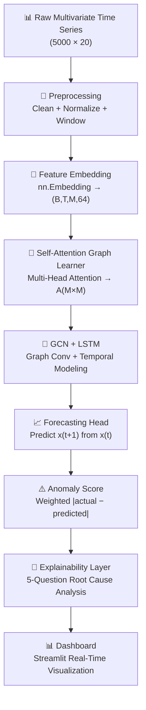
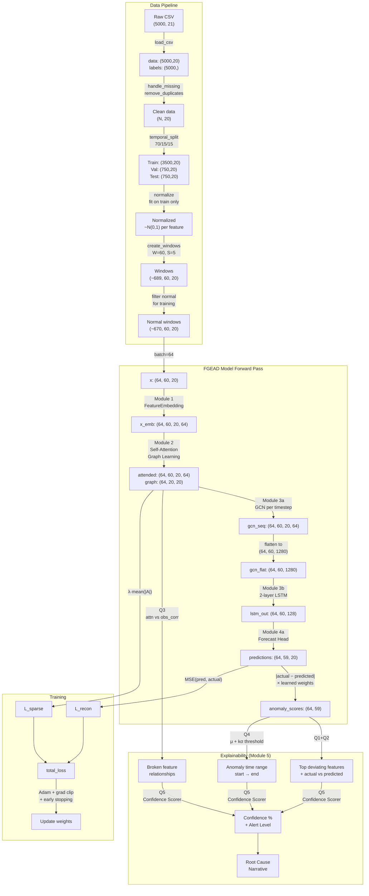

# FGEAD — Complete End-to-End Technical Flow

> **Document Level:** Senior AI/ML Architect · Research Scientist · System Designer
>
> **Project:** Feature Graph Explainable Anomaly Detection (FGEAD)
>
> **Architecture:** Graph Autoencoder + LSTM + Correlation Intelligence

---

## Table of Contents

1. [System Architecture Overview](#1-system-architecture-overview)
2. [Stage 1 — Raw Data Generation](#2-stage-1--raw-data-generation)
3. [Stage 2 — Data Loading & Cleaning](#3-stage-2--data-loading--cleaning)
4. [Stage 3 — Normalization (StandardScaler)](#4-stage-3--normalization-standardscaler)
5. [Stage 4 — Sliding Window Extraction](#5-stage-4--sliding-window-extraction)
6. [Stage 5 — Temporal Split & DataLoader](#6-stage-5--temporal-split--dataloader)
7. [Stage 6 — Module 1: Feature Embedding](#7-stage-6--module-1-feature-embedding)
8. [Stage 7 — Module 2: Self-Attention Graph Learning](#8-stage-7--module-2-self-attention-graph-learning)
9. [Stage 8 — Module 3: Graph Convolution + LSTM](#9-stage-8--module-3-graph-convolution--lstm)
10. [Stage 9 — Module 4: Forecasting Head + Anomaly Scoring](#10-stage-9--module-4-forecasting-head--anomaly-scoring)
11. [Stage 10 — Module 5: Explainability Layer (5-Question Framework)](#11-stage-10--module-5-explainability-layer)
12. [Training Pipeline](#12-training-pipeline)
13. [Evaluation & Baseline Comparison](#13-evaluation--baseline-comparison)
14. [End-to-End Data Flow Diagram](#14-end-to-end-data-flow-diagram)

---

## 1. System Architecture Overview



The FGEAD system is a **semi-supervised anomaly detection** framework. The core insight:

> **Train a model to forecast normal behavior. When reality deviates from the forecast, something is anomalous.**

The model is trained **only on normal data** to learn the forecasting function `f(x_t) → x̂_{t+1}`. At inference time, windows where `|x_{t+1} − x̂_{t+1}|` is large are flagged as anomalous.

What makes FGEAD unique is that it **learns the inter-feature dependency graph** using self-attention, then propagates information along that graph using GCN before feeding into LSTM. This means the model understands not just *what* each feature does, but *how features relate to each other* — enabling it to detect **correlation breaks** (e.g., CPU usage spikes but CPU temperature stays flat → cooling system failure).

---

## 2. Stage 1 — Raw Data Generation

> **Source:** [synthetic_generator.py](file:///d:/fgead/data/synthetic_generator.py)

### Input

No external input. The generator uses a seeded PRNG (`np.random.default_rng(seed=42)`) for reproducibility.

### Process

#### 2.1 Base Signal Construction

```python
data = rng.standard_normal((5000, 20)) * 0.3  # Shape: (5000, 20), dtype: float64
```

This creates a **5000-timestep × 20-feature** matrix of Gaussian noise with σ=0.3.

#### 2.2 Temporal Patterns (Diurnal + Weekly Cycles)

```python
day_cycle  = np.sin(2π · t / 1440)   # 1440 = minutes in a day
week_cycle = np.sin(2π · t / 10080)  # 10080 = minutes in a week
```

Each feature gets a baseline plus scaled cycles:

```
data[:, i] += baseline_i + 0.15 · sin(2πt/1440) + 0.05 · sin(2πt/10080)
```

Where `baseline_i ∈ linspace(0.2, 0.8, 20)` — giving each feature a different operating range.

#### 2.3 Injected Feature Correlations

These simulate real-world physical dependencies:

| Pair | Relationship | Formula |
|------|-------------|---------|
| cpu_usage ↔ cpu_temp | Positive (0.85) | `x₁ = 0.85·x₀ + 0.15·ε` |
| memory_usage ↔ memory_free | Inverse (−0.90) | `x₃ = −0.90·x₂ + 0.10·ε` |
| disk_io_read ↔ disk_io_write | Positive (0.75) | `x₅ = 0.75·x₄ + 0.25·ε` |
| net_in ↔ net_out | Positive (0.80) | `x₇ = 0.80·x₆ + 0.20·ε` |
| load_avg_1m → 5m → 15m | Cascading (0.70) | `x₁₃ = 0.70·x₁₂ + 0.30·ε`, `x₁₄ = 0.70·x₁₃ + 0.30·ε` |

> [!IMPORTANT]
> These correlations are **what the model must learn to detect**. When an anomaly breaks these correlations (e.g., cpu_temp decouples from cpu_usage), the model detects the broken relationship.

#### 2.4 Anomaly Injection (3 Types)

20 anomaly events are distributed across train/val/test splits (70/15/15):

| Type | Mechanism | Duration | Magnitude |
|------|-----------|----------|-----------|
| **Spike** | Random feature jumps 4–6σ | 2–5 steps | `data[idx:idx+len, feat] += U(4,6)` |
| **Correlation Break** | cpu↔cpu_temp decouple | 5–12 steps | `data[idx:idx+len, 1] = N(0,2)` |
| **Gradual Drift** | Memory slowly creeps up | 8–15 steps | `data[idx:idx+len, 2] += linspace(0, U(3,5))` |

### Output

| Artifact | Shape | Dtype | Description |
|----------|-------|-------|-------------|
| `data` | `(5000, 20)` | float64 | Multivariate time series |
| `labels` | `(5000,)` | int (0/1) | Per-timestep anomaly labels |
| `synthetic_data.csv` | 5001 rows × 21 cols | CSV | Serialized to disk |

---

## 3. Stage 2 — Data Loading & Cleaning

> **Source:** [preprocessor.py](file:///d:/fgead/data/preprocessor.py) — `TimeSeriesPreprocessor`

### 3.1 CSV Loading

```python
proc = TimeSeriesPreprocessor(window_size=60, stride=5)
data, labels = proc.load_csv("data/synthetic_data.csv")
```

- Separates the `label` column from feature columns
- Casts features to `float32`, labels to `int`
- **Output:** `data: (5000, 20) float32`, `labels: (5000,) int`

### 3.2 Missing Value Handling

```python
data = proc.handle_missing(data)  # Forward-fill → Backward-fill
```

Converts to a Pandas DataFrame, applies `ffill()` then `bfill()`. This preserves temporal continuity — a missing value at time `t` is assumed to be the same as the last known measurement.

> [!NOTE]
> For synthetic data, there are no NaNs. But this step is critical for real-world deployment where sensor dropouts occur.

### 3.3 Duplicate Removal

```python
data, labels = proc.remove_duplicates(data, labels)
```

Removes exact duplicate rows (timestamps with identical readings across all features). The boolean mask ensures labels stay aligned.

### Output

| Artifact | Shape | Dtype |
|----------|-------|-------|
| `data` | `(N, 20)` where N ≤ 5000 | float32 |
| `labels` | `(N,)` | int |

---

## 4. Stage 3 — Normalization (StandardScaler)

> **Source:** [preprocessor.py](file:///d:/fgead/data/preprocessor.py#L58-L70) — `normalize()`

### Why Normalize?

Features have vastly different scales (CPU temp in °C vs. network errors as counts). Without normalization, high-magnitude features dominate the loss function and attention computation.

### Process

**The scaler is fit ONLY on training data** to prevent information leakage:

```python
n = len(data)
t_end = int(n * 0.70)   # 3500
v_end = int(n * 0.85)   # 4250

train_norm, val_norm, test_norm = proc.normalize(
    data[:t_end],        # fit on this
    data[t_end:v_end],   # transform only
    data[v_end:]         # transform only
)
```

The mathematical operation per feature `j`:

```
x_normalized[i, j] = (x_raw[i, j] − μ_j^train) / σ_j^train
```

Where `μ_j^train` and `σ_j^train` are computed from the training split only.

> [!CAUTION]
> **Critical ML principle:** Never fit the scaler on validation or test data. Doing so leaks future statistical information into training, making results unreliable. This is why `fit_transform()` is called only on `data[:t_end]`, and `transform()` is used for val/test.

### Before & After Example

| Feature | Before (raw) | After (normalized) |
|---------|-------------|-------------------|
| cpu_usage | [0.45, 0.82, 0.63, ...] | [-0.92, 1.34, 0.18, ...] |
| cpu_temp | [0.38, 0.70, 0.54, ...] | [-0.87, 1.21, 0.15, ...] |
| network_errors | [0.95, 1.02, 0.99, ...] | [-0.45, 0.12, -0.11, ...] |

### Output

| Artifact | Shape | Dtype | Range |
|----------|-------|-------|-------|
| `train_norm` | `(3500, 20)` | float32 | ~N(0,1) per feature |
| `val_norm` | `(750, 20)` | float32 | Approx N(0,1) |
| `test_norm` | `(750, 20)` | float32 | Approx N(0,1) |

---

## 5. Stage 4 — Sliding Window Extraction

> **Source:** [preprocessor.py](file:///d:/fgead/data/preprocessor.py#L77-L98) — `create_windows()`

### Why Windows?

Neural networks need fixed-size inputs. A sliding window converts a long time series into overlapping "snapshots" of length `W=60` timesteps, each capturing enough temporal context for the LSTM to model dynamics.

### Process

```
Window_size (W) = 60 timesteps
Stride (S) = 5 timesteps (83% overlap between consecutive windows)
```

For a sequence of length `N`:

```
Number of windows = ⌊(N − W) / S⌋ + 1
```

For the training split (N=3500):
```
n_train_windows = ⌊(3500 − 60) / 5⌋ + 1 = 689
```

Each window is a 2D slice: `data[start : start+60, :]` → shape `(60, 20)`.

### Window Label Assignment

A window is labeled **anomalous (1)** if **any** timestep within it is anomalous:

```python
win_label = int(labels[start:end].any())  # OR-aggregation
```

This is deliberately conservative — if even one timestep in the window is abnormal, the whole window should be investigated.

### Output

| Artifact | Shape | Description |
|----------|-------|-------------|
| `train_win` | `(689, 60, 20)` | Training windows: (n_windows, window_size, n_features) |
| `train_lbl` | `(689,)` | Window-level binary labels |
| `val_win` | `(~139, 60, 20)` | Validation windows |
| `test_win` | `(~139, 60, 20)` | Test windows |

---

## 6. Stage 5 — Temporal Split & DataLoader

> **Source:** [train.py](file:///d:/fgead/train.py#L42-L74) — `build_loaders()`

### Normal-Only Training Filter

```python
normal_mask = tr_lbl == 0
tr_win_clean = tr_win[normal_mask]  # Keep ONLY normal windows
```

> [!IMPORTANT]
> **This is the semi-supervised paradigm.** The model is trained exclusively on normal behavior. It learns: "what does the system look like when everything is OK?" At inference, anything that deviates from learned normality triggers an alarm.

### PyTorch Dataset Wrapper

```python
class TimeSeriesDataset(Dataset):
    def __init__(self, windows, labels=None):
        self.windows = torch.FloatTensor(windows)   # (N, 60, 20)
        self.labels  = torch.LongTensor(labels)      # (N,)
```

### DataLoader Configuration

```python
tr_loader = DataLoader(tr_ds, batch_size=64, shuffle=False)
```

- **batch_size=64:** Each forward pass processes 64 windows simultaneously
- **shuffle=False:** Preserves temporal ordering (important for time series)

### Batch Tensor Shape

```
One batch: x.shape = (64, 60, 20)
           ↓   ↓   ↓
           B   T   M
           Batch  Time  Features
```

---

## 7. Stage 6 — Module 1: Feature Embedding

> **Source:** [graph_learner.py](file:///d:/fgead/models/graph_learner.py#L16-L46) — `FeatureEmbedding`

### Purpose

Each of the 20 features (cpu_usage, cpu_temp, etc.) needs a **learned identity vector** — similar to how word embeddings in NLP give each word a dense representation. This embedding captures *what kind of metric* each feature is.

### Architecture

```
nn.Embedding(n_features=20, embed_dim=64)
nn.LayerNorm(64)
nn.Dropout(0.1)
```

### Forward Pass (Step by Step)

**Input:** `x: (B, T, M) = (64, 60, 20)`

1. **Create feature identity indices:**
   ```python
   feat_ids = torch.arange(M)  # [0, 1, 2, ..., 19]  shape: (20,)
   ```

2. **Look up embedding vectors:**
   ```python
   feat_emb = self.embedding(feat_ids)  # (20, 64) — one 64-dim vector per feature
   ```

3. **Broadcast to match batch and time dimensions:**
   ```python
   feat_emb = feat_emb.unsqueeze(0).unsqueeze(0)  # (1, 1, 20, 64)
   feat_emb = feat_emb.expand(B, T, -1, -1)       # (64, 60, 20, 64)
   ```

4. **Scale by feature values (value-aware embedding):**
   ```python
   val_emb = x.unsqueeze(-1) * feat_emb  # (64, 60, 20, 64)
   ```
   
   This is the key step: the raw scalar value `x[b, t, m]` **scales** the identity vector of feature `m`. A high CPU reading produces a large-magnitude embedding; a near-zero reading produces a small one.

   Mathematically:
   ```
   E[b, t, m, :] = x[b, t, m] · embed[m, :]
   ```

5. **LayerNorm + Dropout:**
   ```python
   output = dropout(layer_norm(val_emb))  # (64, 60, 20, 64)
   ```

### Output

| Tensor | Shape | Meaning |
|--------|-------|---------|
| `x_emb` | `(B, T, M, D) = (64, 60, 20, 64)` | Value-scaled feature embeddings |

---

## 8. Stage 7 — Module 2: Self-Attention Graph Learning

> **Source:** [graph_learner.py](file:///d:/fgead/models/graph_learner.py#L49-L127) — `SelfAttentionGraphLearner`

### Purpose

**Learn which features are related to which** — automatically discover the dependency graph. The attention weight `A[i,j]` represents "how much does feature `j` influence feature `i`?"

> [!IMPORTANT]
> **This is the KEY innovation of FGEAD.** Instead of manually defining a feature dependency graph (which requires domain expertise and doesn't adapt), the model **learns** the graph from data using multi-head self-attention. The graph is dynamic and data-driven.

### Architecture

```
Q_proj: Linear(64, 64, bias=False)
K_proj: Linear(64, 64, bias=False)
V_proj: Linear(64, 64, bias=False)
Out_proj: Linear(64, 64)
n_heads = 4, head_dim = 16
```

### Forward Pass (Step by Step)

**Input:** `x_emb: (B, T, M, D) = (64, 60, 20, 64)`

#### Step 1: Temporal Pooling

```python
x_pool = x_emb.mean(dim=1)  # (64, 20, 64) — average over time
```

**Why?** We want ONE graph per window, not a graph per timestep. Averaging over time produces a stable representation of each feature's "behavior profile" across the whole window.

#### Step 2: Q, K, V Projections

```python
Q = Q_proj(x_pool)  # (64, 20, 64) — "What am I looking for?"
K = K_proj(x_pool)  # (64, 20, 64) — "What do I offer?"
V = V_proj(x_pool)  # (64, 20, 64) — "What information do I carry?"
```

#### Step 3: Reshape for Multi-Head Attention

```python
Q = Q.view(B, M, 4, 16).transpose(1, 2)  # (64, 4, 20, 16)
K = K.view(B, M, 4, 16).transpose(1, 2)  # (64, 4, 20, 16)
V = V.view(B, M, 4, 16).transpose(1, 2)  # (64, 4, 20, 16)
```

4 parallel "attention heads" — each captures a different type of feature relationship.

#### Step 4: Scaled Dot-Product Attention

```
scores = (Q · K^T) / (√d_head · 0.1)     # (64, 4, 20, 20)
attn = softmax(scores / 0.1, dim=-1)      # (64, 4, 20, 20)
```

The temperature scaling (`/ 0.1`) produces **sharper attention distributions** — the model focuses on the most important relationships rather than spreading attention uniformly.

Mathematically for each head `h`:

```
A_h[i, j] = softmax( (Q_h[i] · K_h[j]^T) / (√16 · 0.01) )
```

#### Step 5: Value Aggregation

```python
out = attn @ V  # (64, 4, 20, 16) — each feature is now a weighted mix of all features
```

Feature `i`'s new representation is:

```
out_h[i] = Σ_j A_h[i,j] · V_h[j]
```

If `A[cpu_usage, cpu_temp]` is high, then `cpu_usage`'s representation now contains information from `cpu_temp`.

#### Step 6: Head Concatenation + Output Projection

```python
out = out.transpose(1, 2).view(B, M, D)  # (64, 20, 64)
out = out_proj(out)                        # (64, 20, 64)
```

#### Step 7: Compute Feature Dependency Graph

```python
attn_weights = attn.mean(dim=1)  # (64, 20, 20) — average across heads
```

#### Step 8: Top-K Sparsification

```python
k = 5
topk_vals, topk_idx = torch.topk(attn_weights, k=5, dim=-1)
mask = torch.zeros_like(attn_weights)
mask.scatter_(-1, topk_idx, 1.0)
sparse_graph = attn_weights * mask   # (64, 20, 20)
```

Each feature retains connections to only its **top 5 most related** features. This encourages a **sparse, interpretable** graph.

#### Step 9: Residual Connection

```python
out_expanded = out.unsqueeze(1).expand(-1, T, -1, -1)  # (64, 60, 20, 64)
attended = x_emb + out_expanded                          # (64, 60, 20, 64)
```

### Output

| Tensor | Shape | Meaning |
|--------|-------|---------|
| `attended` | `(B, T, M, D) = (64, 60, 20, 64)` | Graph-enhanced feature embeddings |
| `sparse_graph` | `(B, M, M) = (64, 20, 20)` | Learned feature dependency graph |

### What the Graph Looks Like

The attention matrix is a **20×20 heatmap** where:
- High value at `A[0,1]` (cpu_usage → cpu_temp) means the model learned their correlation
- Near-zero values mean features are independent
- This is visualized as the **"Dynamic Dependency Intelligence Map"** heatmap in the dashboard

---

## 9. Stage 8 — Module 3: Graph Convolution + LSTM

> **Source:** [temporal_gcn.py](file:///d:/fgead/models/temporal_gcn.py)

### Purpose

1. **GCN:** Propagate information along the learned graph — each feature "talks" to its neighbors
2. **LSTM:** Capture temporal dynamics over graph-enhanced features

### 9.1 Graph Convolution Layer

> **Source:** [temporal_gcn.py](file:///d:/fgead/models/temporal_gcn.py#L14-L44) — `GraphConvolution`

```
Architecture: Linear(64, 64, bias=False) + BatchNorm1d(64) + ReLU
```

**Mathematical operation:**

```
h_new = ReLU(BN(Â · h · W))
```

Where:
- `h: (B, M, 64)` — node features (each feature is a "node")
- `Â = D⁻¹A` — row-normalized adjacency (from attention graph)
- `W: (64, 64)` — learnable weight matrix

**Step by step:**

```python
# Row-normalize adjacency
row_sum = adj.sum(dim=-1, keepdim=True).clamp(min=1e-6)
adj_norm = adj / row_sum               # (64, 20, 20)

# Aggregate: each node = weighted sum of neighbor features
agg = torch.bmm(adj_norm, h)            # (64, 20, 64)

# Transform
out = self.W(agg)                       # (64, 20, 64)
out = F.relu(out)                       # (64, 20, 64)

# BatchNorm over the feature dimension
out = bn(out.view(B*M, D)).view(B, M, D)  # (64, 20, 64)
```

**Intuition:** If `cpu_usage` is connected to `cpu_temp` in the graph, then after GCN, `cpu_usage`'s representation contains a weighted mix of its own features + `cpu_temp`'s features. The model now "knows" about cross-feature dependencies at each timestep.

### 9.2 Temporal Model (GCN + LSTM)

> **Source:** [temporal_gcn.py](file:///d:/fgead/models/temporal_gcn.py#L47-L95) — `TemporalGraphModel`

```
Architecture:
  GCN: GraphConvolution(64, 64)
  LSTM: nn.LSTM(input_size=20*64=1280, hidden_size=128, num_layers=2, dropout=0.2)
```

**Forward Pass:**

```python
# Apply GCN at each timestep
for t in range(T):                          # T = 60
    h_t = x_emb[:, t, :, :]                # (64, 20, 64)
    g_t = self.gcn(h_t, adj)               # (64, 20, 64)
    gcn_outs.append(g_t)

# Stack and flatten node features
gcn_seq = torch.stack(gcn_outs, dim=1)      # (64, 60, 20, 64)
gcn_flat = gcn_seq.view(B, T, M * gcn_out)  # (64, 60, 1280)

# Feed to LSTM
lstm_out, _ = self.lstm(gcn_flat)            # (64, 60, 128)
```

**LSTM Details:**
- **Input size:** 20 features × 64 dims = 1280 per timestep
- **Hidden size:** 128
- **Layers:** 2 (stacked LSTM)
- **Dropout:** 0.2 between layers

The 2-layer LSTM processes the sequence `(B, 60, 1280)` and outputs `(B, 60, 128)`:
- Layer 1: captures short-range patterns
- Layer 2: captures higher-order temporal abstractions

### Output

| Tensor | Shape | Meaning |
|--------|-------|---------|
| `lstm_out` | `(B, T, H) = (64, 60, 128)` | Temporal context vectors |

---

## 10. Stage 9 — Module 4: Forecasting Head + Anomaly Scoring

> **Source:** [fgead.py](file:///d:/fgead/models/fgead.py#L64-L106)

### 10.1 Forecasting Head

```python
self.forecast_head = nn.Sequential(
    nn.Linear(128, 64),    # 128 → 64
    nn.ReLU(),
    nn.Dropout(0.2),
    nn.Linear(64, 20),     # 64 → 20 (one prediction per feature)
)
```

**Applied to timesteps t=0 through T-2:**

```python
predictions = self.forecast_head(lstm_out[:, :-1, :])  # (64, 59, 20)
```

For each timestep `t`, the model predicts what `x[t+1]` should look like based on everything it has seen up to time `t`.

### 10.2 Anomaly Scoring

**Compute per-feature errors:**

```python
actual = x[:, 1:, :]                          # (64, 59, 20)
errors = torch.abs(predictions - actual)       # (64, 59, 20)
```

**Weighted aggregation:**

```python
# Learnable feature importance weights
self.score_weights = nn.Parameter(torch.ones(20) / 20)  # initialized uniform

weights = F.softmax(self.score_weights, dim=0)           # (20,) sums to 1
anomaly_scores = (errors * weights).sum(dim=-1)          # (64, 59)
```

The formula:

```
score(t) = Σ_{j=1}^{M} w_j · |x_actual[t,j] − x_predicted[t,j]|
```

Where `w_j = softmax(θ_j)` are **learned during training**. Features that are more informative for anomaly detection get higher weights.

### Output

| Tensor | Shape | Meaning |
|--------|-------|---------|
| `predictions` | `(B, T-1, M) = (64, 59, 20)` | Next-step forecasts |
| `attn_weights` | `(B, M, M) = (64, 20, 20)` | Feature dependency graph |
| `anomaly_scores` | `(B, T-1) = (64, 59)` | Per-timestep anomaly scores |

### Window-Level Score

During evaluation, the **max** score across all timesteps is used as the window's anomaly score:

```python
window_score = float(s.max().cpu())  # Single scalar per window
```

---

## 11. Stage 10 — Module 5: Explainability Layer

> **Source:** [explainer.py](file:///d:/fgead/models/explainer.py)

The explainability layer answers **5 questions** for every anomaly alert. This is the key differentiator from black-box models.

### Q1 + Q2: Which Features Deviated Most? What Were Their Values?

> **Source:** [explainer.py](file:///d:/fgead/models/explainer.py#L32-L81) — `FeatureDeviationAnalyzer`

**Process:**

1. Find the **peak anomaly timestep:** `peak_t = argmax(anomaly_scores) + 1`
2. Extract actual vs. predicted values at peak:
   ```
   actual_at_peak = x_window[peak_t]        # (20,)
   pred_at_peak   = pred_window[peak_t - 1]  # (20,)
   ```
3. Compute deviations: `dev = |actual − predicted|` per feature
4. Compute z-scores: `z_j = dev_j / σ_j^window` where `σ_j^window` is the feature's standard deviation within this window
5. Rank features by deviation magnitude → return top K

**Output example:**

```
Feature            Actual    Predicted   Deviation   Z-score   Direction
memory_usage       2.4312    0.5481      1.8831     12.3σ      ↑ spike
cpu_temp          -0.3121    0.4892      0.8013      5.1σ      ↓ drop
cache_misses       1.2045    0.6231      0.5814      3.8σ      ↑ spike
```

### Q3: Which Feature Relationships Broke?

> **Source:** [explainer.py](file:///d:/fgead/models/explainer.py#L88-L186) — `GraphRelationshipAuditor`

**Process:**

1. Extract the **learned attention weights** `A[i,j]` — what the model expects
2. Compute the **observed correlation matrix** from the anomaly window:
   ```python
   obs_corr = np.corrcoef(x_window[peak-5 : peak+5].T)  # (20, 20)
   ```
3. For each feature pair `(i, j)` where expected correlation > 0.10:
   - Compute gap: `|observed − expected|`
   - If gap > 0.10 → relationship is broken
4. Classify break type:
   - **COMPLETE DECOUPLING:** expected > 0.7 but observed < 0.1
   - **SIGN REVERSAL:** expected > 0 but observed < 0
   - **PARTIAL WEAKENING:** everything else

**Output example:**

```
cpu_usage ↔ cpu_temp    expected=0.85  observed=0.12  [COMPLETE DECOUPLING]
→ Thermal issue — CPU load and temperature de-synced
```

### Q4: When Did the Anomaly Start and End?

> **Source:** [explainer.py](file:///d:/fgead/models/explainer.py#L192-L269) — `AnomalyRangeDetector`

**Algorithm (Two-Pass):**

1. **Dynamic threshold:** `τ = μ(scores) + k·σ(scores)` where k=2.0
2. **Flag anomalous timesteps:** `is_anomalous = (scores > τ)`
3. **Find contiguous runs:** using `np.diff()` on padded binary array
4. **Merge nearby segments:** if gap between two segments ≤ 3 steps, merge them
5. **Filter by minimum duration:** segments < 1 step are noise

### Q5: How Confident Is the Model?

> **Source:** [explainer.py](file:///d:/fgead/models/explainer.py#L276-L336) — `ConfidenceScorer`

**Confidence is a weighted combination of 4 signals:**

```
C = 0.40 · S_score + 0.25 · S_duration + 0.20 · S_features + 0.15 · S_graph
```

| Signal | Formula | Intuition |
|--------|---------|-----------|
| `S_score` | `min(1, (peak − τ) / (0.25τ))` | How far above threshold? |
| `S_duration` | `min(1, duration / (0.3 · T))` | How long does it last? |
| `S_features` | `min(1, n_deviating / (0.3 · M))` | How many features affected? |
| `S_graph` | `min(1, n_broken / (0.2 · n_edges))` | How many relationships broke? |

**Alert level mapping:**

| Confidence | Level |
|-----------|-------|
| ≥ 80% | 🔴 CRITICAL — Act immediately |
| ≥ 60% | 🟠 HIGH — Investigate now |
| ≥ 40% | 🟡 MEDIUM — Monitor closely |
| < 40% | 🟢 LOW — Log and watch |

### Root Cause Inference

The explainer synthesizes a human-readable root cause from:
1. **Dominant feature keywords** (cpu, mem, disk, net)
2. **Top deviating signals** (direction + z-score)
3. **Broken relationships** (which pairs decoupled)

Example output:
```
💡 Likely Root Cause:
   Likely memory-pressure event: memory_usage ↑ spike, cache_misses ↑ spike,
   cpu_usage/cpu_temp complete decoupling
```

---

## 12. Training Pipeline

> **Source:** [train.py](file:///d:/fgead/train.py)

### Loss Function

```python
total_loss = MSE_loss + λ · L1_sparsity_loss
```

**Component 1 — Reconstruction (Forecasting) Loss:**
```
L_recon = (1/BT) Σ_b Σ_t Σ_m (x̂[b,t,m] − x[b,t+1,m])²
```

This is the primary objective: minimize forecasting error on **normal data only**.

**Component 2 — Sparsity Regularization:**
```
L_sparse = λ · mean(|A|)
```
Where λ = 0.01 and A is the attention weight matrix. This encourages the learned graph to be **sparse** (most edges ≈ 0, only strong dependencies survive).

### Optimizer & Scheduler

```python
optimizer = Adam(lr=1e-3, weight_decay=1e-4)
scheduler = ReduceLROnPlateau(patience=5, factor=0.5)
```

- **Weight decay (1e-4):** L2 regularization on all parameters
- **ReduceLROnPlateau:** Halves learning rate if validation loss plateaus for 5 epochs

### Gradient Clipping

```python
nn.utils.clip_grad_norm_(model.parameters(), max_norm=1.0)
```

Prevents exploding gradients (common in LSTMs and attention mechanisms).

### Early Stopping

```python
patience = 10  # Stop if no improvement for 10 epochs
```

### Training Data

**Only normal windows are used.** Anomalous windows are filtered out:
```python
normal_mask = tr_lbl == 0
tr_win_clean = tr_win[normal_mask]
```

The model never sees anomalies during training. It learns the manifold of normal behavior.

---

## 13. Evaluation & Baseline Comparison

> **Source:** [evaluate.py](file:///d:/fgead/evaluate.py)

### Threshold Calibration

The threshold is calibrated on the **validation set** to maximize F1:

```python
for thr in linspace(min_score, max_score, 200):
    preds = (scores >= thr)
    f1 = f1_score(labels, preds)
    if f1 > best_f1: best_thr = thr

thr *= 1.05  # +5% to reduce false positives
```

### FGEAD vs. Baselines

| Model | Approach | Captures Correlations? | Explainable? |
|-------|----------|----------------------|-------------|
| **FGEAD (Proposed)** | Graph Attention + GCN + LSTM forecasting | ✅ Via learned attention graph | ✅ 5-question framework |
| **Isolation Forest** | Tree-based statistical outlier | ❌ Features treated independently | ❌ No |
| **LSTM Autoencoder** | Sequence-to-sequence reconstruction | ⚠️ Implicitly via hidden state | ❌ No |

### Metrics Computed

- **Precision:** TP / (TP + FP) — "Of things flagged, how many were real?"
- **Recall:** TP / (TP + FN) — "Of real anomalies, how many were caught?"
- **F1 Score:** Harmonic mean of precision and recall
- **AUC-ROC:** Area under receiver operating characteristic curve

---

## 14. End-to-End Data Flow Diagram



### Summary of Tensor Transformations

| Stage | Input Shape | Output Shape | Key Operation |
|-------|-------------|--------------|---------------|
| Raw Data | — | (5000, 20) | Generation |
| Normalization | (N, 20) | (N, 20) | Z-score standardization |
| Windowing | (N, 20) | (W, 60, 20) | Sliding window, stride=5 |
| Batching | (W, 60, 20) | (64, 60, 20) | DataLoader |
| Feature Embedding | (B, 60, 20) | (B, 60, 20, 64) | Embedding lookup × value |
| Self-Attention Graph | (B, 60, 20, 64) | (B, 60, 20, 64) + (B, 20, 20) | Multi-head attention + top-K sparsify |
| GCN (per timestep) | (B, 20, 64) + (B, 20, 20) | (B, 20, 64) | ·h·W + ReLU + BN |
| LSTM | (B, 60, 1280) | (B, 60, 128) | 2-layer LSTM |
| Forecast Head | (B, 59, 128) | (B, 59, 20) | MLP: 128→64→20 |
| Anomaly Scoring | (B, 59, 20) | (B, 59) | Weighted MAE |
| Window Score | (B, 59) | (B,) | max() |

---

> [!TIP]
> **Interview Key Takeaway:** FGEAD's power comes from three synergistic components working together:
> 1. **Self-Attention Graph** — learns *which* features depend on *which* (structural intelligence)
> 2. **GCN** — propagates information along those dependencies (spatial reasoning)
> 3. **LSTM** — captures *how* those relationships evolve over time (temporal reasoning)
>
> When all three agree that something is wrong, the confidence is high. The explainability layer then translates the model's internal state into human-understandable root cause analysis.
